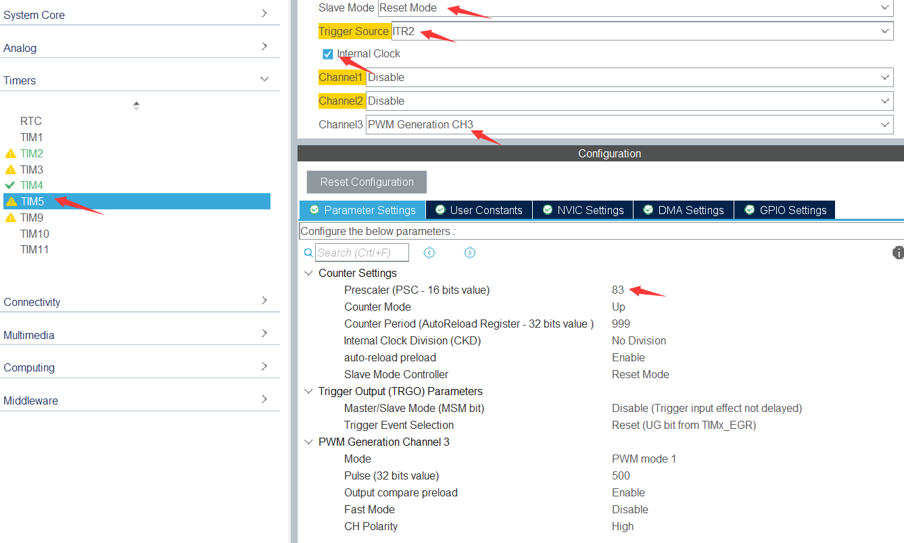
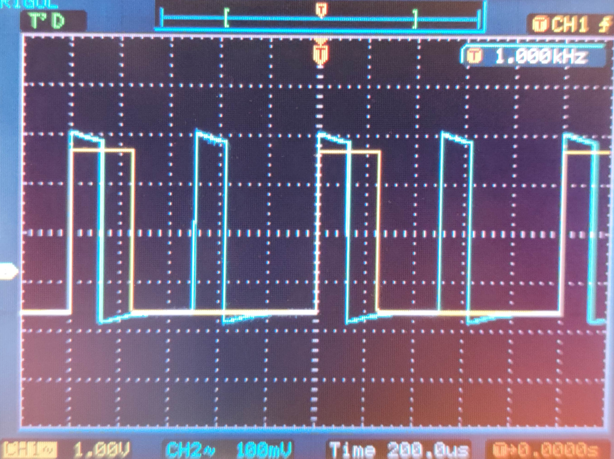

<!--more-->

## 前言

​		单片机提高部分是怎么回事呢？单片机相信大家都很熟悉，但是单片机提高部分是怎么回事呢，下面就让小编带大家一起了解吧。
　　单片机提高部分，其实就是修炼境界，大家可能会很惊讶单片机怎么会提高部分呢？但事实就是这样，小编也感到非常惊讶。
　　这就是关于单片机提高部分的事情了，大家有什么想法呢，欢迎在评论区告诉小编一起讨论哦！

​		咳咳，看到有部分小部员对校初选单片机方向挺积极的，挺好，也激发了讲师我自己的求知欲。本文主要内容为校初选单片机方向的提高部分：PWM倍频和PWM移相。写这篇文档的原因一是之前你们俊杰学长发的文档没有讲全（本来就不应该讲太详细，得靠你们自己学）；二者俊杰学长的方法只能实现占空比为50%的PWM信号的移相，其余占空比不能实现，不完美；三者是笔者去年校初选的提高部分就是移相，当时没有做出来，挺遗憾的，这次就算是补上了。

## 如何实现

### 前言

​		你们可以点击[这里](https://blog.csdn.net/qq_39758638/article/details/106638644?ops_request_misc=%257B%2522request%255Fid%2522%253A%2522163991657116780274129854%2522%252C%2522scm%2522%253A%252220140713.130102334.pc%255Fall.%2522%257D&request_id=163991657116780274129854&biz_id=0&utm_medium=distribute.pc_search_result.none-task-blog-2~all~first_rank_ecpm_v1~rank_v31_ecpm-1-106638644.pc_search_insert_es_download&utm_term=CUBEMX+PWM%E7%A7%BB%E7%9B%B8&spm=1018.2226.3001.4187)查看一篇文章，本文的主要方法就来自于它，但根据实际情况作出修改，从而实现任意占空比的PWM移相，灰常完美。

​		关于具体原理，我们已经能够理解，可惜这里空白的地方太小，写不下。所以，对下面内容原理感兴趣或者有疑问的童鞋可以先查看上面的文章，自行搜索STM32的主从定时器等相关关键词，查看**F401中文参考手册15.3.14 定时器与外部触发同步**，实在不理解就到322来问学长学姐吧。

### CUBEMX设置

我这里开TIM2作为输入捕获的定时器，具体配置与俊杰学长之前发的文档一样，不赘述：


开启TIM4作为主定时器，与文章不同，因为这个定时器的功能是实现移相，所以我们不需要PWM输出，Channel选择PWM Generation No Output：

在这里，根据实际表现来说，TIM4 CH1 的CCR的值就决定了主定时器与从定时器的时间差，从而影响PWM的相位差，后面的代码部分会有体现这一点。


开启TIM5定时器作为PWM输出：

注意：①Trigger Source的选择查看前言文章的插图

​			②Trigger Source选择好后，实际上TIM4和TIM5已经作为主从定时器被“链接”到一起了。为了避免在边沿同步时由于时钟不同步引起的奇怪Bug，所以TIM5的PSC的值应与TIM4的PSC的值一致

​			③把ARR改小，以免出现51秒无PWM输出的经典问题



### 代码

while(1)里面我们要对输入捕获进行运算，以及根据频率与占空比的需要修改TIM5定时器的ARR与CCR，以及根据相位差需要修改TIM4的CCR：

```c
TIM5->ARR=(uint32_t)(1000000.0/freq-1);
TIM5->CCR3=(uint32_t)((TIM5->ARR+1)*duty);

TIM4->CCR1=(uint32_t)((TIM5->ARR+1)*degree/360.0);

capfreq = 84000000.0f / TIM2->CCR1;
capduty = (float)TIM2->CCR2 / TIM2->CCR1;
```

我这里设置了一个状态位mode作为两种模式（移相和倍频）的切换，大家也可以这样，让自己的代码逻辑性更强，更好添加新功能（感兴趣自行搜索“状态机”）：

```c
uint8_t mode=2;//1：倍频  2：移相
```

在while(1)里面对mode进行轮询，根据需要修改PWM输出的频率(freq)和占空比(freq)：

```c
if(mode==1){
    freq=capfreq*multiple;
    duty=capduty;
}
if(mode==2){
    freq=capfreq;
    duty=capduty;
}
```

在while(1)里面通过按键切换模式和更改倍频系数或者移相角度：

```c
if(HAL_GPIO_ReadPin(KEY2_GPIO_Port,KEY2_Pin)==GPIO_PIN_RESET){
    HAL_Delay(200);
    mode++;
    if(mode>2)
        mode=1;
    degree=0;multiple=1
}
if(HAL_GPIO_ReadPin(KEY1_GPIO_Port,KEY1_Pin)==GPIO_PIN_RESET){
    HAL_Delay(200);
    if(mode==1)
        multiple++;
    if(mode==2){
        degree+=15;
        if(degree>=360)
            degree=0;
    }
}
```

屏幕显示啥的不说了。

在

```c
/* USER CODE BEGIN 0 */

/* USER CODE END 0 */
```

里面添加一些代码实现PWM“对齐”，因为主定时器(TIM4)与从定时器(TIM5)存在时间差（实际表现出来即为相位差）。所以我们只需要把TIM2与TIM4“对齐”，那么输入捕获(TIM2)就与从定时器(TIM5)存在时间差（实际表现出来即为相位差），实现移相：

```c
void HAL_TIM_IC_CaptureCallback(TIM_HandleTypeDef *htim){
    if (htim->Instance == TIM2)
        if (htim->Channel == HAL_TIM_ACTIVE_CHANNEL_1)
            TIM4->EGR |= TIM_EVENTSOURCE_UPDATE;
}
```

结束。

### 看看效果

移相：


倍频：




效果灰常的好哇！你们加油，祝你们好运。

#### 校科协电子部第30届单片机讲师

#### 叶青云 2021.12.21